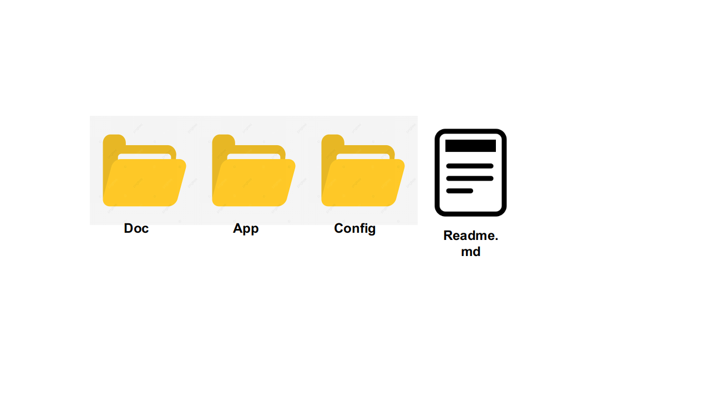

## Penjelasan GitIgnore
Apa itu gitignore? gitignore merupakan sebuah file yang akan digunakan untuk mengabaikan `file` atau `folder` agar git tidak melakukan perekaman terhadapa file tersebut. Sebaiknya pembuatan file gitignore dilakukan diawal pembuatan repositori.
***
## Kenapa Gitignore Penting
Jika anda seorang programmer yang berkerja menggunakan framework, akan lebih baik anda menggukanan `file .gitignore` yang sudah disediakan. Anda bisa lihat <a href="https://github.com/github/gitignore">disini.</a>
<br>
Salah satu contoh kasus : 
Pada gambar diatas anda melihat beberapa `folder`, didalam folder tersebut ada beberapa konfigurasi yang tidak ingin orang mengetahuinya. misalkan `folder config`, folder tersebut merupakan konfigurasi program anda termasuk password, database, API bahkan yang lain. Jika anda tidak mengabaikannya menggunakan file `.gitignore` otomatis folder tersebut akan tersimpan kedalam repositori anda.

## Membuat File Gitignore
jika anda ingin membuat file `gitignore` anda tinggal membuat fil dengan nama **`.gitignore`** setelah anda membuat file tersebut, anda tinggal menambahkan **folder** atau **file** yang akan dimasukkan ke dalam daftar yang akan diabaikan oleh git. 

## Menambahkan File atau Folder kedalam .**`gitignore`**
Untuk menambahkan file atau folder yang akan anda abaikan oleh git juga bisa melalui terminal, anda bisa mengetikkan seperti berikut :
1. melalui terminal
```console
echo "nama_file" > .gitignore
```
menggunakan script diatas akan lebih baik digunakan saat di awal pembuatan file `.gitignore`

dan untuk seterusnya anda bisa mengetikkan script berikut :
```console
echo "nama_file" >> .gitignore
```
2. melalui file `.gitignore`
   <br>


## Permasalahan .gitignore tidak berfungsi
Permasalahan yang sering ditemukan file `.gitignore` tidak berfungsi, yaitu anda melakukan penambahan folder atau file ke dalam file `.gitignore` setelah melakukan `commit`. Jadi itulah pentingnya anda melakukan pembuatan file `.gitignore` diawal pembuatan `repositori`.
<br><br>
Jika hal ini terlanjur anda lakukan, maka yang harus anda lakukan adalah menghapus histori `commit` yang telah anda lakukan terhadap file atau folder tersebut.
Anda bisa mengikuti cara berikut :
``` console
git rm -r --cached "nama_file"
```
Script diatas lebih berfungsi digunakan untuk menghapus file dari indeks. Dalam kasus dimana file sudah di simpan, `git rm --cached` akan menghapus file dari indeks, meninggalkannya di direktori kerja dan komit sekarang akan menghapusnya dari repo juga. Pada dasarnya, setelah komit, Anda akan membatalkan versi file dan menyimpan salinan lokal.

<br> Setelah anda melakukan hal diatas, coba lakukan `commit` di working area anda.
Anda bisa cek video di youtube 
<a href="https://www.youtube.com/watch?v=NeC9C6xjwA4&list=PL6wCUclraERJPVh0BPxAUAIOFG9SZKyDT&index=4"> TDF Programming </a>